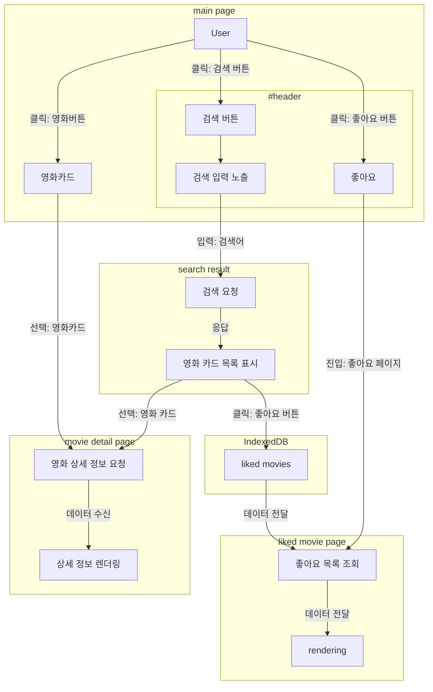

<p align="center">
  <h1 align="center">VideOn</h1>
  <h4 align="center">movie information site with pure vanila js</h4>
</p>

<b><i><p align="center">EST soft, FE 4기, 2조</p></i></b>

## 팀원

<table>
  <tr>
    <th>이름</th>
    <th>역할</th>
  </tr>
  <tr>
    <td align="center"><a href="https://github.com/choroc">오초록</a></td>
    <td align="center">팀장</td>
  </tr>
  <tr>
    <td colspan="2">
      <ul>
        <li>프로젝트 목표 설정 및 진행 관리
        <li>기획 및 전체 일정 관리
        <li>디자인 및 와이어프레임 제작
        <li>영화 정보 상세 페이지 개발
        <li>공통 컴포넌트(swiper--over-ride ...) 제작 및 구현
      </ul>
    </td>
  </tr>
  <tr>
    <td align="center"><a href="https://github.com/kib09">김인배</a></td>
    <td align="center">팀원</td>
  </tr>
  <tr>
    <td colspan="2">
      <ul>
        <li>공통 컴포넌트(main-header ...) 제작 및 구현
        <li>검색 결과 페이지 개발
        <li>tmdbAPI사용하여, 추가 검색 기능 개발
        <li>tmdb API <=> imdb API 사이 핸들링 기능 구현
      </ul>
    </td>
  </tr>
  
  <tr>
    <td align="center"><a href="https://github.com/jadewisemann">정유진</a></td>
    <td align="center">팀원</td>
  </tr>
  <tr>
    <td colspan="2">
      <ul>
        <li>형상 관리
        <li>commit · coding convention 관리
        <li>문서 관리
        <li>배포 담당
        <li>컴포넌트 로직 구현
        <li>공통 컴포넌트(movie-card, card-section ...) 구현
        <li>메인 페이지, 찜한 영화 페이지 개발
      </ul>
    </td>
  </tr>

</table>

## 프로젝트 개요

- omdbAPI, 오픈소스로 영화 정보를 제공하는 api를 이용하여 정보를 받아오고 해당 정보를 유저에게 제공하는 기능을 구현한 사이트

## 개발 환경


[](https://discord.com/)


- html 5
- vanilla `javaScript`
  - `Query String`
  - 'indexedDB'
  - **MPA**
- styling: `sass`
    
### 의존성

- [swiper.js](https://github.com/nolimits4web/swiper)

### 프로젝트 관리

- 형상관리: `github`
- 일정 관리: `discord`
- 지식 관리: `github wiki`

### 배포

- [vercel](https://vercel.com/) 

## 기능 요구사항


### 필수 기능

  - [x] 영화 제목으로 검색 
  - [x] 검색 결과 페이지에서 영화 목록 출력
  - [x] 영화목록에서 각 영화의 상세 페이지 구성
    - [x] 제목, 개봉연도, 평점, 장르, 감독, 배우, 줄거리, 포스터 ...
  - [x] 검색 사이트를 배포 ('Vercel' or 'Netlify')

### 선택 기능

  - [x] 다보기로 영화 목록을 추가로 불러오기
    - [ ] ~~infinity scroll~~
      - omdb의 경우 초기값이 10개인데 환경에 따라 사용자의 의사와 반하게 동작할 가능성을 고려, 버튼으로 구현 
  - [ ] 상세 검색
    - [ ] 연도로 검색 + ...
  - [x] 로딩 애니메이션
    - [ ] 초기 로딩
    - [x] 검색 중 
  - [x] 포스터가 없을 경우 대체 이미지
  - [x] 상세정보를 고해상도로 출력
  - [x] 영화와 관련된 기타 기능

### 추가 기능

  - [ ] 매인 화면에 영화 정보를 하드 코딩하지 않기
    - [ ] 다른 api 사용
  - [ ] 로그인 (oAuth w.Fire Base)
  - [x] 관심 목록 (localStorage or **indexed db**)
  - [ ] 메세지 및 언어 분리 ⇒ i18n 대응

## 기능 구현 설명 (추후 추가 예정)

### js

### style

### 컨벤션

### 프로젝트 관리

## 링크


or [click](https://m.site.naver.com/1Bu3W)

## 데이터 흐름



## 프로젝트 구조

```
📦 root
┣━ 📦 asset           # 이미지, 폰트 등
┃   ┣━ 📦 data        # 더미 데이터
┃   ┣━ 📦 font        # 폰트
┃   ┣━ 📦 img         # 이미지 
┃   ┣━ 📦 js          # static한 js
┃   ┗━ 📦 ....
┣━ 📦 css             # 스타일
┃   ┣━ 📦 abstract    # 변수, @mix-in ...
┃   ┣━ 📦 components  # 컴포넌트 
┃   ┣━ 📦 config      # 설정(rem ...)
┃   ┣━ 📦 layout      # 공통 페이지 구성 요소 
┃   ┣━ 📦 pages       # 페이지 종속적 스타일
┃   ┣━ 📦 vendor      # 벤더 프리픽스
┃   ┗━ 📜 style.css   # 최종 컴파일 css
┣━ 📦 docs            # 문서 (컨벤션 및 컴포넌트, api 예제)
┣━ 📦 public          # 배포될 html 파일
┃   ┣━ 📜 index.html
┃   ┣━ 📜 search-result.html
┃   ┗━ 📜 ....
┗━ 📦 src            # 소스코드
    ┣━ 📦 components # 컴포넌트
    ┣━ 📦 layout     # 공통 페이지 구성 요소소
    ┣━ 📦 pages      # 페이지별 js 로직
    ┗━ 📦 utils      # 유틸 함수
```
