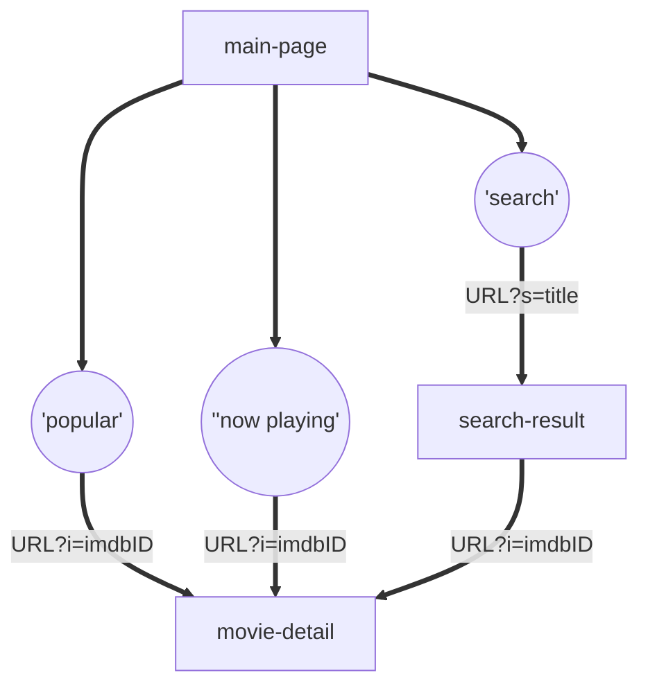

<p align="center">
  <h1 align="center">VideOn</h1>
  <h4>movie information site with pure vanila js</h4>
</p>

<b><i><p align="center">EST soft, FE 4기, 2조</p></i></b>

## 팀원

<table>
  <tr>
    <th>이름</th>
    <th>역할</th>
  </tr>
  <tr>
    <td align="center"><a href="https://github.com/choroc">오초록</a></td>
    <td align="center">팀장</td>
  </tr>
  <tr>
    <td colspan="2">
    
    </td>
  </tr>
  <tr>
    <td align="center"><a href="https://github.com/kib09">김인배</a></td>
    <td align="center">팀원</td>
  </tr>
  <tr>
    <td colspan="2">

    </td>
  </tr>
  <tr>
    <td align="center"><a href="https://github.com/zeeeeeee0">장지영</a></td>
    <td align="center">팀원</td>
  </tr>
  <tr>
    <td colspan="2">

    </td>
  </tr>
  <tr>
    <td align="center"><a href="https://github.com/jadewisemann">정유진</a></td>
    <td align="center">팀원</td>
  </tr>
  <tr>
    <td colspan="2">

    </td>
  </tr>

</table>

## 프로젝트 개요

- omdbAPI, 오픈소스로 영화 정보를 제공하는 api를 이용하여 정보를 받아오고 해당 정보를 유저에게 제공하는 기능을 구현한 사이트

## 개발 환경

  - styling: `sass`
  - *web-first*
  - `Query String`
  - MPA
  - no library or framework, vanila js
  
  - 일정 관리
    - discord
    - github project
  
  - 지식 관리
    - github wiki
  

## 기능 요구사항

### 필수 기능

  - [ ] 영화 제목으로 검색 
  - [ ] 검색 결과 페이지에서 영화 목록 출력
  - [ ] 영화목록에서 각 영화의 상세 페이지 구성
    - [ ] 제목, 개봉연도, 평점, 장르, 감독, 배우, 줄거리, 포스터 ...
  - [ ] 검색 사이트를 배포 ('Vercel' or 'Netlify')

### 선택 기능

  - [ ] 다보기로 영화 목록을 추가로 불러오기
    - [ ] infinity scroll
  - [ ] 상세 검색
    - [ ] 연도로 검색 + ...
  - [ ] 로딩 애니메이션
    - [ ] 초기 로딩
    - [ ] 검색 중 
  - [ ] 포스터가 없을 경우 대체 이미지
  - [ ] 상세정보를 고해상도로 출력
  - [ ] 영화와 관련된 기타 기능

### 추가 기능

  - [ ] 매인 화면에 영화 정보를 하드 코딩하지 않기
    - [ ] 다른 api 사용
  - [ ] 로그인 (oAuth w.Fire Base)
  - [ ] 관심 목록 (localStorage or indexed db)
  - [ ] 메세지 및 언어 분리 ⇒ i18n 대응

## 데이터 흐름



## 프로젝트 구조

```
📦 root
┣━ 📦 aseets          # 이미지, 폰트 등
┣━ 📦 css             # 스타일
┣━ 📦 docs            # 문서
┣━ 📦 public          # 정적인 html 파일
┃   ┣━ 📜 index.html
┃   ┣━ 📜 search-result.html
┃   ┗━ 📜 ....
┗━ 📦 src            # 소스코드
    ┣━ 📦 components # 컴포넌트
    ┣━ 📦 pages      # 페이지별 js 로직
    ┗━ 📦 utils      # 유틸 함수
```
